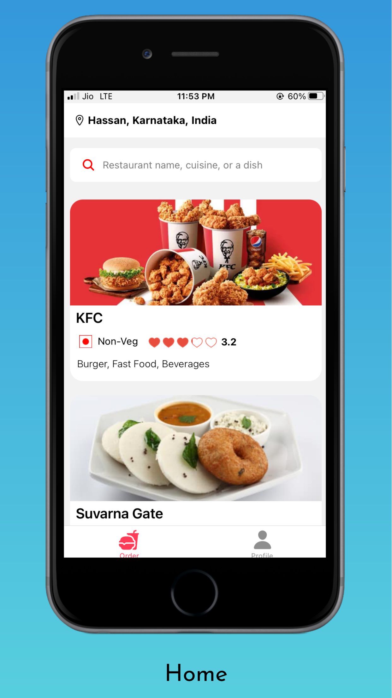
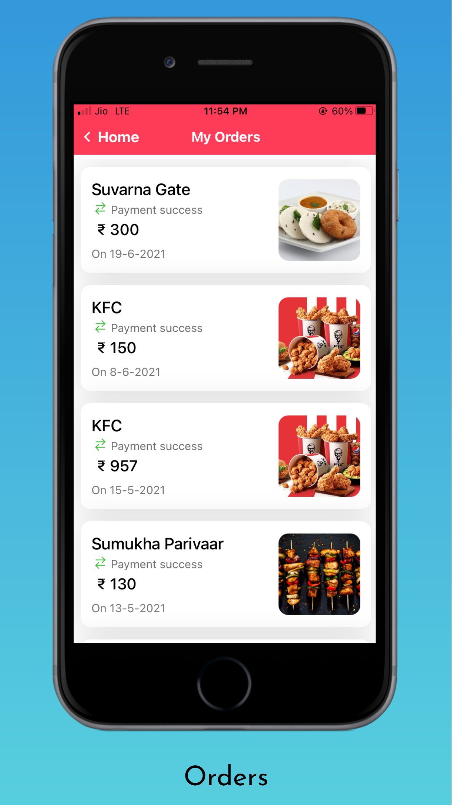

# Food-Delivery-Mobile-Application

(Zomato/swiggy clone)

Download apk/s from latest release/artifacts

[Apk - Foodzy 1.0.0](https://github.com/shreyashc/Food-Delivery-Mobile-Application/releases/download/v1.0.0/foodzy.1.0.0.apk)

[Resturant/admin website / api (foodzy-backend.herokuapp.com)](https://foodzy-backend.herokuapp.com/auth/login)

|       Frontend        |       Backend        |
| :-------------------: | :------------------: |
| React Native (Mobile) |        Nodejs        |
|  expo (now ejected)   |      Expressjs       |
|      Typescript       | PostgreSQL + TypeORM |
|          Pug          |      Typescript      |
|       Bootstrap       |   Stripe Payments    |
|   Firebase storage    |        Heroku        |

## screenshots

